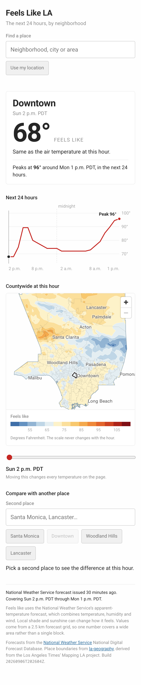

# The interface

A single page: pick a place, read what it will feel like, scrub the next 24 hours, compare
with somewhere else. TypeScript and Vite, MapLibre GL for the map, D3 scales and shapes for
the chart. It reads the published build and holds no forecast logic of its own.

## What it shows

The card is the product. Place name, the forecast hour, apparent temperature in whole
degrees, air temperature underneath, and the peak over the published window. When the two
temperatures round to the same number the card says so instead of printing it twice: in
mild LA weather they agree by definition, and a repeated number reads as a bug.

Everything on the page is tied to one `hour` in one store. The card, the chart cursor, the
comparison sentence and the map frame cannot show different times, because there is only
one hour to show. The [smoke checks](#verification) assert this after a scrub rather than
trusting it.

## Decisions worth recording

**The map uses no basemap.** No tile provider, no glyph server, no API key. Every layer
comes from this build's own GeoJSON: the county silhouette, the contour bands, place
outlines. Partly reliability, since the only thing left to fail is a frame fetch. Mostly
honesty: a street basemap under a 2.5 km forecast grid implies a precision the data does
not have.

**Labels are HTML, not a symbol layer.** A MapLibre symbol layer needs glyph PBFs from a
font server, which is the dependency the paragraph above just removed. With a curated list
of 16 places, a greedy collision pass gives the same sparse result, in the page's own
webfont, with nothing to fetch. The list is in `config/forecast.toml` and every slug is
checked against the place index at build time.

**The county silhouette earns its 5.8 KB twice.** It draws the coastline and county line,
without which an afternoon in the 60s is a pale shape on a pale page with nothing to
recognize. And it fills the county in the no-data gray beneath the bands, so a cell with
no forecast reads as a hole rather than as whatever sits behind it.

**MapLibre loads in its own chunk.** It is 286 KB gzipped against 63 KB for everything
else, so it arrives after the card, chart and slider are on screen. If it never arrives,
or the browser cannot draw it, the map panel explains itself and every number keeps
working. A browser check with WebGL disabled asserts exactly that.

**Comparisons are computed after rounding.** 71.4° and 70.6° both display as 71°, so
comparing the stored values would let the card claim a difference it is not showing. Two
places in the same forecast cell get told they share a cell, which is a real answer rather
than a failure to hide.

**An exact coordinate takes its own cell and borrows a place's name.** Two parts of a large
neighborhood can land in different cells, and that is the point. The name is a label. The
temperature comes from the coordinate.

**Geolocation is asked for on a click and never reaches the URL.** A geolocated selection
leaves the URL at the root, because a shared link should not carry where someone was
standing. Denial is recoverable: the message points at the search box, which never needed
permission in the first place.

## The lookup, and why it has a fixture

`grid.json` publishes the projection parameters and the arithmetic for turning a coordinate
into a cell id. The browser uses proj4js and those published values; the pipeline used
pyproj and its own resolver. If the two disagree anywhere, a reader gets a real
temperature, correctly formatted, from the wrong 2.5 km cell. Nothing about that looks
broken.

So `scripts/web_lookup_fixture.py` writes the Python answers for 1,170 coordinates — all
270 place reference points plus a 30-by-30 grid across the county, dense enough that many
cases land near a cell boundary — and `web/test/lookup.test.ts` asserts the browser agrees
on every one. Regenerate it with `make web-fixture` after any change to the grid, the crop
window or the published formula.

## States

| State | What the reader sees |
| --- | --- |
| Loading | The card says so; nothing else has rendered yet |
| A place outside coverage | Named, with the reason, falling back to downtown |
| An unknown slug in the URL | The same, saying which name was not found |
| A missing hourly value | An em dash, and a line saying the grid has no value here |
| No refresh for three hours | A flagged note giving the age of the last successful update |
| An old source run | A separately flagged note, because a fresh download can carry a stale forecast |
| Every hour in the past | The forecast claim is dropped |
| A map that cannot start | The panel explains; the card and chart are untouched |
| One hour's frame missing | The map says so and points at the card, which still applies |

Source age and refresh age are independent facts and are reported independently. NDFD
stamps a run for the half hour after it posts, so source age is often slightly negative on
a fresh cycle; it clamps at zero rather than reporting a forecast issued in the future.

## Verification

`make web` runs three layers.

`npx tsc --noEmit` and `npx vitest run` cover the lookup against the Python fixture, the
rounding and comparison rules, the freshness thresholds, the hour labels through a
daylight-saving change, and search ranking.

`make web-smoke` drives the built bundle in the installed Chrome against the real published
build. It checks a phone and a desktop viewport, a direct place link with a comparison in
the query, an unknown slug, keyboard-only search, arrow keys on the slider, and a run with
WebGL disabled. It asks the map what it actually drew rather than trusting that it did,
through a `window.feelslike` handle that is also useful in the console.

Two bugs came out of writing those checks, both invisible in a screenshot. The selected
place was never outlined, because the highlight filter was set against a layer that did not
exist yet and nothing asked again. And scrubbing left the map on the old hour, because
`flush` was gated on `isStyleLoaded()`, which reads false while any source is loading and
so dropped every update that landed in the first few seconds. The map was showing a
temperature four classes away from the card.

One thing the checks deliberately do not assert: that the band drawn under a place exactly
matches the class its own value falls in. Contours are interpolated between cell centers
while the card samples one cell, so where a value sits a third of a degree from a break the
boundary genuinely runs through the reference point and either side is right. Exact
agreement is required only when the value is a degree clear of a break. Being two or more
classes off always fails, because that means the map is drawing another hour.

## Not built

No autoplay, no hour in the shareable URL, no saved comparison, no dark mode. Reference
points for the 264 places outside the reviewed six are still `polylabel` output, which is
adequate for compact neighborhoods and wants review for the coastal, elongated and very
large ones.
