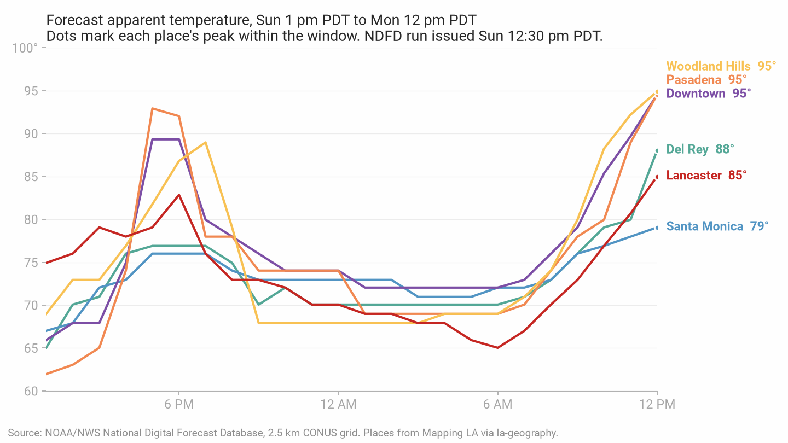
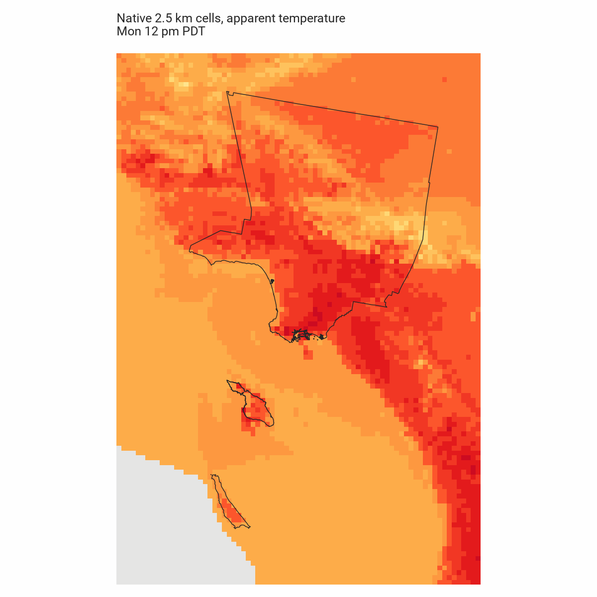
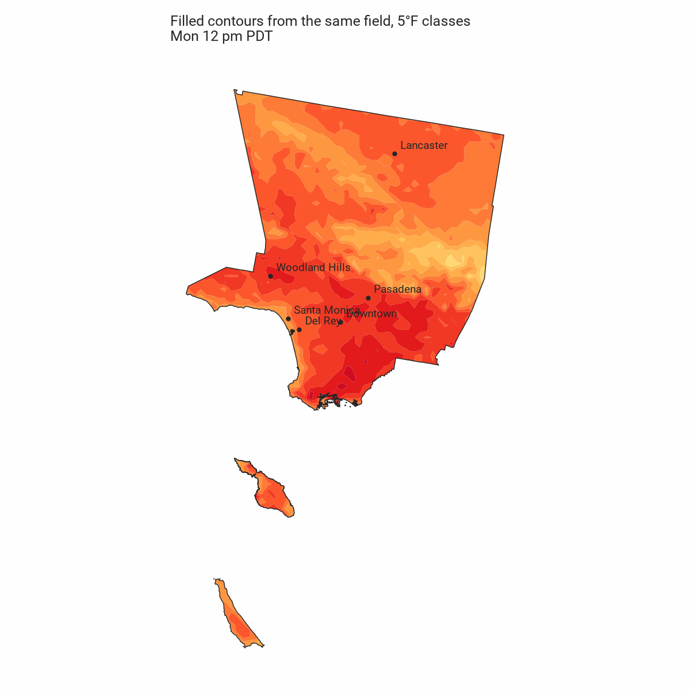

# Milestone 1: prove the data

One NDFD cycle, downloaded and decoded on Sept. 6, 2026. Everything below comes from
that single build. One cycle says nothing about forecast accuracy, and a different day
would show different numbers.

Reproduce with `uv run python -m feelslike_la.fetch` then `uv run python -m feelslike_la.prototype`.
NDFD files rotate out of the bucket, so this build's own output is kept alongside this
write-up in [`prototype-findings.json`](prototype-findings.json). A later run reads
whatever cycle is current and will produce different numbers.

## What the source actually is

Both variables come from one place in NOAA's public bucket:

- `s3://noaa-ndfd-pds/opnl/AR.conus/VP.001-003/ds.apt.bin`, 44.6 MB
- `s3://noaa-ndfd-pds/opnl/AR.conus/VP.001-003/ds.temp.bin`, 43.6 MB

Downloaded over HTTPS in about two seconds each. `VP.001-003` is the days-one-through-three
window, which is where the hourly forecasts live; the later windows step to coarser
intervals. Checksums and retrieval times are recorded per file in `download.json`.

Decoded properties, read from GRIB metadata rather than inferred:

| Property | Value |
| --- | --- |
| Grid | 2145 x 1377 cells, Lambert conformal conic on a 6,371,200 m sphere |
| Cell size | 2,539.703 m, so 1.58 miles |
| Declared unit | `[C]`, converted with `F = C * 9 / 5 + 32` |
| Nodata | 9999 |
| Messages per file | 42 |
| Reference time | 2026-09-06T19:30:00Z, one run for every message in both files |
| Valid times | 2026-09-06T20:00Z through 2026-09-09T00:00Z |
| Steps | 36 consecutive hourly steps, then three-hourly |
| Grid fingerprint | `sha256:74f909fb1200dcbfb93cb34e1d82cbf0`, identical across both files |

The two files agree on grid geometry and on all 42 valid times, so apparent and air
temperature can be sampled as one aligned stack without regridding.

The file was 10 minutes old when downloaded, measured against the run's reference time.
Source freshness, not the download timestamp, is what the interface should use for a
staleness state.

That subtraction can go negative, though. A later build the same afternoon retrieved a file
at 20:26Z whose reference time was 20:30:00Z, and the file's own `Last-Modified` was
20:22Z. Both observed cycles were posted about 22 minutes past the hour and stamped with
the following half hour, so a run can be several minutes "newer" than the moment it was
downloaded. A freshness check has to clamp at zero rather than display a negative age.
Two cycles is not enough to call that a rule about NDFD's schedule.

### A 24-hour horizon is available, with a caveat

36 consecutive hourly steps comfortably covers a rolling 24-hour horizon, and this build
produced a complete one: 2026-09-06T20:00Z through 2026-09-07T19:00Z, or 1 p.m. Sunday
through noon Monday in local time.

The horizon truncates the following afternoon. Lancaster's highest value in the window is
85°F at the end of Sunday afternoon, and its Monday afternoon peak falls outside the
window entirely. Three of the six places have their in-window maximum at the final hour.
So "peak" over a rolling 24-hour window is not the same as a daily high, and the label
has to say "next 24 hours" and mean it.

### Decoding is correct, checked against a second route

NOAA warns that some decoders mishandle the NDFD grid's scanning pattern and recommends
`grib2io` for Python. That package ships source-only and needs NCEPLIBS-g2c headers,
which are not available through Homebrew, so this prototype decodes with GDAL 3.13.3
through rasterio and verifies the result instead of assuming it.

Compared against `api.weather.gov` gridpoint data for the first six hours at each of the
six places, 27 of 36 values match within 0.1°F, which is the API's whole-degree rounding
step. Five of the six places never differ by more than 0.23°F:

| Place | NWS grid | Largest difference, first six hours |
| --- | --- | --- |
| Del Rey | LOX 148,43 | 0.09°F |
| Santa Monica | LOX 146,45 | 0.09°F |
| Pasadena | LOX 159,48 | 0.07°F |
| Woodland Hills | LOX 143,52 | 0.23°F |
| Lancaster | LOX 164,72 | 0.15°F |
| Downtown | LOX 155,44 | 3.09°F |

A flipped or misordered grid could not produce that agreement, and neither could a wrong
unit conversion or a misaligned valid time.

Downtown is the exception and has two available explanations that this comparison cannot
separate. The API response was stamped 18:26Z, one cycle older than the 19:30Z run in the
GRIB files, and downtown sat in a steep gradient that afternoon, where the API's own cell
choice and this pipeline's nearest-cell choice can differ. The four largest differences
there are in the first four hours and shrink to 0.33°F afterward, which is what a vintage
difference looks like. Treat the API as a comparison route with its own timing, not as
ground truth.

## Local detail is real, and larger than expected

At a single hour, apparent temperature across the 1,691 native cells inside Los Angeles
County spanned:

| | Spread across the county at one hour |
| --- | --- |
| Smallest, midnight Monday | 27.0°F |
| Median hour | 35.9°F |
| Largest, 8 p.m. Sunday | 46.3°F |

Every hour in the window occupied at least six 5°F classes, and up to ten. That answers
the open question from the plan: 5°F display classes are enough, and 2°F classes are not
needed. The product's premise holds, at least on this day.

The six-place series shows the same thing at reader scale. At 5 p.m. Sunday, Pasadena was
forecast at 93°F and Santa Monica at 76°F, a 17°F difference between two places 21 miles
apart. Across the window, the spread among just these six ran from 4°F in the small hours
to 17°F in the late afternoon.

Range within the window, per place:

| Place | Low | High | Range |
| --- | --- | --- | --- |
| Santa Monica | 67 | 79 | 12 |
| Lancaster | 65 | 85 | 20 |
| Del Rey | 65 | 88 | 23 |
| Woodland Hills | 68 | 95 | 27 |
| Downtown | 66 | 95 | 29 |
| Pasadena | 62 | 95 | 33 |

Santa Monica's 12°F range against Pasadena's 33°F is the coastal-versus-valley contrast
the product exists to show. Lancaster looks mild here only because its Monday afternoon
sits outside the window.

### Apparent temperature usually equals air temperature

Across all 144 place-hours, apparent minus air temperature ran from -0.9°F to +9.9°F, and
87.5% of values were within 0.5°F of each other. The NWS specification applies heat index
only above 80°F and wind chill only below 51°F, so on a mild LA day the two numbers
coincide. The interface has to survive showing a "feels like" number identical to the air
temperature most of the time, without the reader concluding it is broken.

## Maps

Native cells, no smoothing, at the window's hottest hour:

The same field as filled 5°F contours, clipped to the county:

The gray wedge in the southwest of the raw map is nodata: the NDFD mosaic covers coastal
waters but ends offshore. 580 of the 8,436 cells in the cropped window are nodata, and all
580 sit in that offshore corner. Zero of the 1,691 cells inside the county are missing.
Catalina and San Clemente islands both have forecast values, so island coverage is real
rather than an artifact of the clip.

`isobands` 0.2.3 worked as documented: `from_raster(data, levels=..., crs=..., nodata=...)`
returns a GeoDataFrame with `min_value`, `max_value` and `geometry`. Its own
`python -m isobands check` reports GDAL 3.13.3 as an untested version, since 3.13.2 is the
newest it lists, but contouring works. Pin the version and recheck when GDAL moves.

### Frame size needed fixing

The first contoured frame was 3.26 MB. Almost all of it was the county boundary: clipping
against the full-resolution polygon copies its 66,738-vertex coastline into every band
that touches the water, and the contours themselves contribute only about 3,500 vertices.

Simplifying the clip mask by 0.0005 degrees, roughly 55 m, and writing coordinates at four
decimals gives an identical-looking map at a workable size:

| | Bytes | Gzipped | Vertices |
| --- | --- | --- | --- |
| Full-resolution clip | 2.55 MB | — | 71,066 |
| Simplified clip mask | 110.7 KB | 24.4 KB | 5,452 |

24 frames comes to about 2.7 MB raw and 585 KB gzipped, with the first frame at 24 KB.
GeoJSON is fine here; vector tiles are not needed. The simplification changes only the
drawn coastline, never a temperature value.

Frames are serialized directly rather than through GDAL's GeoJSON driver, because a driver
round-trip turned the null boundary of an open-ended class into the string `"60.0"`.

### Contours and cell sampling disagree at class edges, as expected

The forecast card reads a native cell. The map draws interpolated contours. At the peak
hour, four of six reference points fell inside the band matching their cell value. The two
that did not were both within 1°F of a class break: Santa Monica's cell read 79.07°F
inside the 80-to-85 band, and Woodland Hills' read 94.91°F inside the 95-to-100 band.

That is contour interpolation between cell centers, not a bug, and it is why the card must
never take its number from the polygon a point lands in. Worth watching for a place whose
map color and stated temperature straddle a break in a way a reader would notice.

## Geography

The full places layer at `stilesdata.com/la-geography/la_neighborhoods_comprehensive.geojson`
is 6.02 MB with 270 features; the simplified export is 1.30 MB. Both were last modified
Dec. 7, 2025.

Two open questions from the plan are now settled:

- **The count is 270**, matching the la-geography README rather than the 269 in
  `config/layers.yml`, which allows a tolerance of five and so passes either way. No
  duplicate slugs, no empty slugs, no invalid or empty geometries. The full and simplified
  exports carry identical slug sets, so display geometry and lookup geometry stay joinable.
- **The lookup's bounding box does exclude parts of the county.** The layer's own bounds
  are -118.9449 to -117.6464 and 33.2991 to 34.8232, and the county boundary reaches
  32.7952°N at San Clemente Island. The `lambda/lookup/config.py` box of -119.0 to -117.6
  and 33.7 to 34.8 cuts off both islands and clips the northern county line. This project
  derives its coverage envelope from the polygons instead.

Type values in the export are `segment-of-a-city` (114), `standalone-city` (87) and
`unincorporated-area` (69). Those are the source's own strings and are preserved as
`source_type`; any reader-facing category needs an explicit mapping.

### Reference points

Default reference point is the pole of inaccessibility of a place's largest polygon part,
which lands inside the polygon and away from its edges. All 268 computed points landed
inside their own polygon, with no fallback to a representative point. Six places were
reviewed for this prototype and two needed overrides, recorded with reasons in
`config/place_overrides.json`:

- Pasadena's computed point drifted west toward the Arroyo Seco, and its polygon includes a
  detached eastern annexation. Moved to Colorado and Fair Oaks.
- Lancaster covers 102 square miles of mostly open desert. Moved to Lancaster Boulevard and
  Sierra Highway.

Reviewed points sit 0.44 to 0.98 miles from their assigned cell's center, all well within
one 1.58-mile cell. All six landed in distinct cells, so no two of these places share a
forecast, though adjacent small neighborhoods legitimately will.

## What remains uncertain

- Forecast accuracy. Not testable from one cycle, and out of scope.
- Whether 5°F classes hold up on a genuinely flat day. This day had 27 to 46°F of county
  spread; a marine-layer day in June could compress that.
- Reference points for the other 264 places are computed but unreviewed. Coastal,
  elongated and mountainous places need eyes on them before publication.
- Update cadence in practice. Two cycles an hour apart is not a schedule, and the bucket
  advertises refreshes as often as every half hour for some elements.
- Whether apparent and air temperature always share a reference time. They did in both
  observed cycles, and the pipeline refuses to build if they ever diverge.
